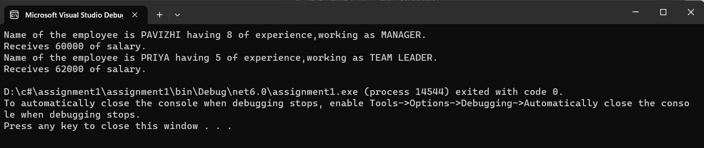

## Ex04-Constructor
## Aim:
To write a C# program to calculate the salary of an employee by passing the name, designation, noofexperience, basic salary and insurance amount through constructor.
 
## Algorithm:
## Step1:
Start the program.

## Step2:
Create a class and a constructor.

## Step3:
Get name, designation, noofexperience, basic salary and insurance amount from the User.

## Step4:
call salary method in constructor to calculate salary.

## Step5:
call display method to display the output.

## Step6:
End the program.
 
 
 ## Program:
 ```
 using System;
public class Employee
{
    public String designation;
    public String employee_name;
    public int exp;
    public int bs;
    public int insurance;
    double hra, ta, salary;

    public Employee(String employee_name, String designation, int exp, int bs, int i)
    {
        this.employee_name = employee_name;
        this.designation = designation;
        this.exp = exp;
        this.bs = bs;
        this.insurance = i;
    }
    public void sal()
    {
        hra = this.bs * 0.2;
        ta = this.bs * 0.1;
        salary = this.bs + hra + ta - this.insurance;

    }
    public void display()
    {

        Console.WriteLine("Name of the employee is {0} having {1} of experience,working as {2}.", this.employee_name, this.exp, this.designation);
        Console.WriteLine("Receives {0} of salary.", salary);

    }

}
class TestEmployee
{
    public static void Main(string[] args)
    {
        Employee e1 = new Employee("PAVIZHI", "MANAGER", 8, 50000, 5000);
        e1.sal();
        Employee e2 = new Employee("PRIYA", "TEAM LEADER", 5, 50000, 3000);
        e2.sal();
        e1.display();
        e2.display();

    }
}
 ```
 ## Output:
 
 ## Result:
Thus C# program to calculate the salary of an employee by passing the name, designation, noofexperience, basic salary and insurance amount through constructor is executed successfully.